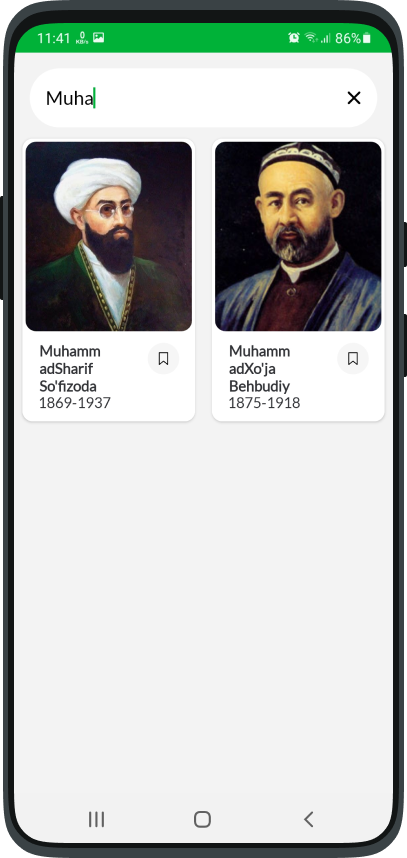
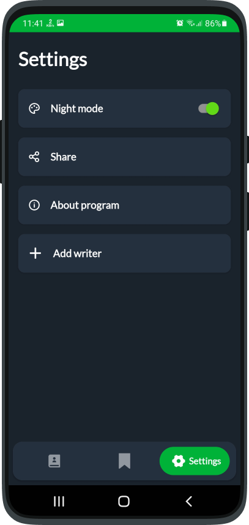
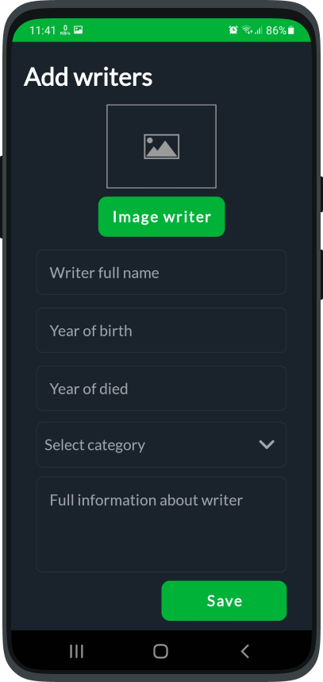

# Writers
<h4>This app for lovers of uzbek and world literature.It have been connected  with Firebase Storage and Firestore.You can add writer.<h4>

<h2>DAY MODE<h2>

  
  
  

<h2>NIGHT MODE<h2>

  
  

<h2>VIDEO<h2>

https://user-images.githubusercontent.com/77713867/177042486-d85dd3a4-3ab0-4b03-a47d-0cb9fcdf07b5.mp4

# Icons

<h3>I made icon for this app.<h3>

